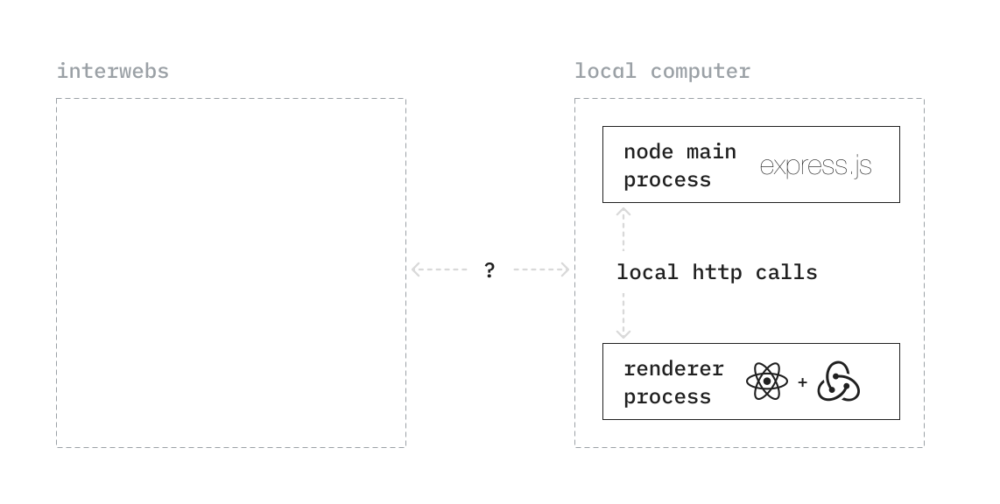
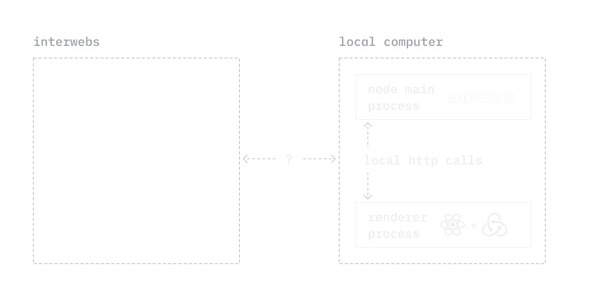
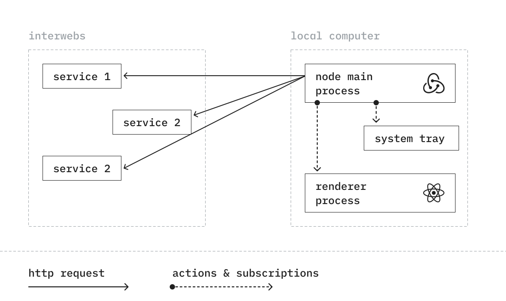
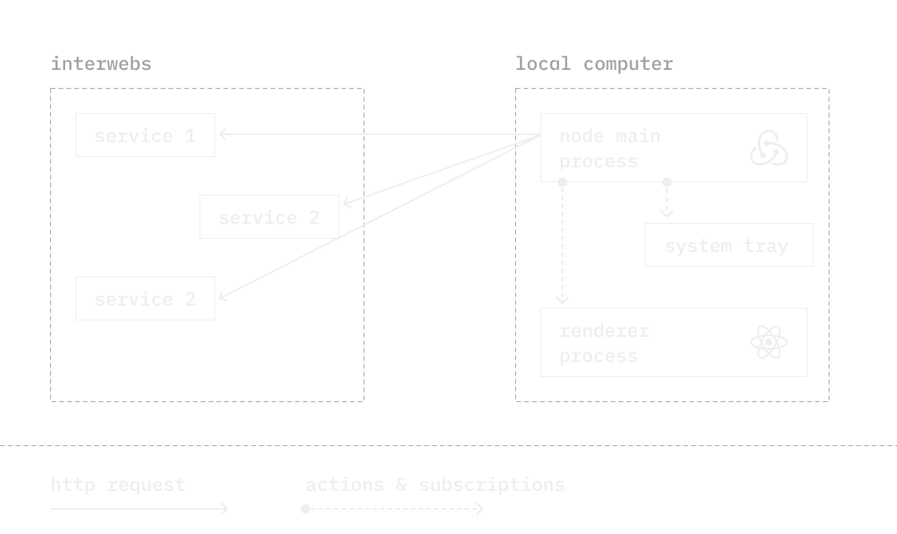

import TextSlice from 'src/components/TextSlice.astro'
import QuoteSlice from 'src/components/QuoteSlice.astro'

<TextSlice>

It all started when I first had contact with a large desktop application, it had a view layer written with web-technology and a “backend” layer written on a entirelly different language — running on users’ computer. It resembled the typical client-server architecture we usually find on web applications: rest-like http endpoints, a SPA frontend and a somewhat big gap between them.

    

    

After a while, I realized that although we mostly mimic what happens on these traditional web applications we needed some _extra power_ to accomplish what we envisioned. So we’ve started blindly breaking standards: http endpoints wasn’t enough, we needed something to actually *sync* the 2 sides. So we wrapped our endpoints on [a custom-made web-sockets layer](https://technology.riotgames.com/news/under-hood-league-client%E2%80%99s-hextech-ui#:~:text=DATA%20SYNCHRONIZATION), ideally keeping all the endpoints intact, and _magically_ get updates across the 2 parts of the app using web-socket messages.

    

    

While it’s a bit *magical* and really served the needs for a bunch of years, iterating on a product with so many layers felt a bit too tiresome, error prone, and mostly inneficient. We ended up using this proprietary communication layer between every 2 pieces of the app (called plugins), and that required:

1. serializing the state to json when sending data
1. deserializing from json to a custom `struct` when consuming data
1. a [_non-circular_ directed graph](https://en.wikipedia.org/wiki/Directed_acyclic_graph) to coordinate dependencies between these internal pieces

    

    

I felt that the aforementioned limitations started slowing us down and was really cumbersome to explain all the gymnastics we have to do overcome them.

</TextSlice>

<QuoteSlice author='A co-worker once joked'>
    We should put [redux](https://redux.js.org/) on the backend
</QuoteSlice>

<TextSlice>

That phrase struck me: only the _utterly derranged_ would dream of putting these words together — _but also_ — what more could we lose? We were still wandering, looking for alternatives, and no obvious one seemed to fit. We even tried following the best practices of api and web development and it didn’t solved all our problems, at least not on the long run.

Then, reassessing the phrase, it all made sense: we weren’t building a traditional client/server web application, the "frontend" and "backend" weren’t miles apart: they were the same application! running on the same computer!

> No matter how many programming languages, or how deep the system calls would be, the application was still mostly frontend: a client to some external services.

Of course a typical html+css+js inside a browser can’t achieve everything a desktop application might want to do. Some features needs code outside the browser window, interacting with the system, io, etc. But that doesn’t mean the communication between these 2 parts *need* to be complex.

Looking for inspiration, most of the resources online of "electron+redux" points to the typical way of using redux on the frontend, either under the react tree or some other frontend framework.

    

    

</TextSlice>

<TextSlice>

But I knew there was potential to use it to bridge the node layer (usually called the "main" process) and other parts of the app.

On github and reading some blog posts, I discovered that many people also used express.js (or other generic node server library) on the main process. So one idea we could try standardizing redux inside http, but I feel like coming back to the same complexity/indirection road we strive for getting away from.

    

    

Reading a bit closer to the source — on electron’s documentation — I realized it also exposed this ["inter-proccess communication" api](https://electronjs.org/docs/latest/api/ipc-main) that allows different parts of the application to talk to each other on this 2-way event handling fashion using anything that could be [serialized](https://developer.mozilla.org/en-US/docs/Web/API/Web_Workers_API/Structured_clone_algorithm) as messages, going through named channels.

The examples are usually to open [some native dialog](https://electronjs.org/docs/latest/tutorial/ipc#pattern-2-renderer-to-main-two-way) or simple things like console logging inputs from the other side, but it was always kinda boresome to write, and didn’t granted end-to-end type-safeness (you need to write it your self on both ends, what each message on each channel receives/returns).

</TextSlice>

<TextSlice>

## We had our mind set on some guiding principles:
1. a single source of truth (one redux store)
1. laying on the longer running process (the main node process)
1. a simple way for all the pieces (frontend, tray, node) to subscribe and send actions transparently.

I was lucky to find we weren’t the only crazy ones, it turns out [Klarna](https://klarna.com/) fiddled with [this combination on 2016](https://github.com/klarna/electron-redux) and it served as a great source of inspiration. It followed most of the above requirements, but a bit more complex than i would like: they use a redux store on the main process, and another on each browser window — and they also stopped maintaining it.

    

    

It took just couple hours to create an proof-of-concept — after all, it’s just typescript, running on both sides. Most of the work was figuring out what we wanted, the technical part was basically integrating 2 well defined and well documented APIs.

</TextSlice>

<TextSlice>

## What’s next?

As usual, i got excited with the idea, and evolved the naïve proof-of-concept as an open-source library called [reduxtron](https://github.com/vitordino/reduxtron), it contains a [demo application](https://github.com/vitordino/reduxtron/tree/main/packages/demo) showing off some cool features and streamlined boilerplates focused on [react](https://github.com/vitordino/reduxtron/tree/main/packages/boilerplate-react), [svelte](https://github.com/vitordino/reduxtron/tree/main/packages/boilerplate-svelte) and [vue](https://github.com/vitordino/reduxtron/tree/main/packages/boilerplate-vue) development.

The core library is rather small, and it already follows the latest electron safety guidelines, so i don’t expect to need that much maintenance or adding feaures. As it’s backed by `redux`™, you can plug your own logic, or use libraries like [`redux-undo`](https://github.com/omnidan/redux-undo))

</TextSlice>

<TextSlice>

## Related reads:

* [Klarna](https://klarna.com/)’s [`electron-redux`](https://github.com/klarna/electron-redux) library
* [Local-first web development](https://localfirstweb.dev/)

</TextSlice>
